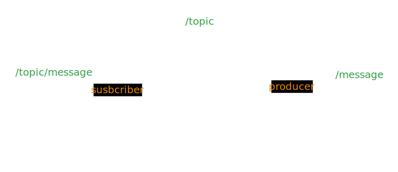

# Geospatial Data

* there are multiple solutions to save this like _Redis geospatial indexes, mongodb geospatial indexes and also postgres has ssolution for that_
* how this internally works - using algo like QUAD TREE


### how to choose Db - sql or nosql

* whenever you have transactional data liek booking, payment — RDBMS
* easy to use — RDBMS
* good lanagauage sql easy for fast development liek development productivity — RDBMS
* many ORMS support — RDBMS
* ( you cannot scale SQL — wrong statement 100% )


* logs, location, keyValue pair, neo4j graphdb — NOSQL


### UberLocationService

<figure><figcaption></figcaption></figure>



### integrating redis

* jedis is javaclient for that
*

    ```
    implementation "redis.clients:jedis:5.1.2"
    ```


* config and controller

```java
@Configuration
public class RedisConfig {

private static final String REDIS_HOST = "redis-11644.c62.us-east-1-4.ec2.redns.redis-cloud.com";
private static final int REDIS_PORT = 11644;
private static final String REDIS_PASSWORD = "YqEuTNiwLlJZZPiEutAKwATnYSifEZt3";

@Bean
public RedisConnectionFactory redisConnectionFactory() {
    JedisConnectionFactory jedisConnectionFactory = new JedisConnectionFactory();
    jedisConnectionFactory.setHostName(REDIS_HOST);
    jedisConnectionFactory.setPort(REDIS_PORT);
    jedisConnectionFactory.setPassword(REDIS_PASSWORD);
    return jedisConnectionFactory;
}

@Bean
public RedisTemplate<String, String> redisTemplate() {
    RedisTemplate<String, String> redisTemplate = new RedisTemplate<>();
    redisTemplate.setConnectionFactory(redisConnectionFactory());
    redisTemplate.setKeySerializer(new StringRedisSerializer());
    redisTemplate.setValueSerializer(new StringRedisSerializer());
    return redisTemplate;
}
}
```

```
// location-controller.js

```
