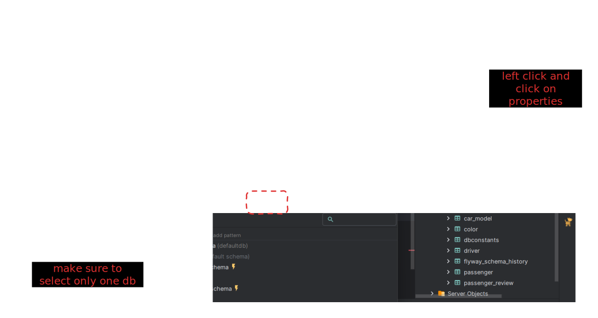

# HLD - uber


**we need a design a set of services that can help us to onboard restaturant and then for any incoming order help us to find a set of nearby drivers**


* how to uniquely identify a location —  ( latitude , longitude )

Restaurant Table



| RestId | lat | longi |
| ------ | --- | ----- |
|        |     |       |
|        |     |       |
|        |     |       |



| driverId | live\_latitude | live\_longitude |
| -------- | -------------- | --------------- |
|          |                |                 |
|          |                |                 |
|          |                |                 |



* bruteforce approach - you go to all drivers in the list calculate distance between driver and restaurant with euclidian equation and where you can identify that this this this driver is in less than 5km distance

$$
d = √((x₂ - x₁)² + (y₂ - y₁)²)
$$

* GeoHashing ( searching problem ) —&#x20;

* for Geohash of restaurant we can identidy that box and get all drivers within that box
* but with in that box we cannot identify KM
* lets assume that box has 50 drivers
* so now you  can use eculidan equation to identify drivers which has distance is less than 5KM
* liek below

Problem — what if restaurant is not present in the middle the box? then what

* what is solution \
  Db like geo hashed based queries
  * redis - geohashing storing
  * google firebas geohash
  * mongoDb also supports geospecial data ( geojson obj )&#x20;
  * shard your data in db based on geo hash
* Another one way like ( [https://www.geeksforgeeks.org/dsa/find-if-a-point-lies-inside-or-on-circle/](https://www.geeksforgeeks.org/dsa/find-if-a-point-lies-inside-or-on-circle/) )

* we are going to be there on last updated data ( not live data )
* another is web socket, updating data live

