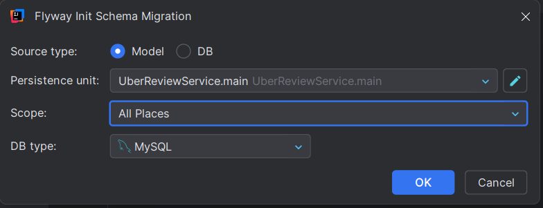

# SOCKJS | STOMP

```
implementation 'org.springframework.boot:spring-boot-starter-websocket'
```

* simple messaging protocol that forward message from oneside to other side


— here /topic is the name of message broker\
— /message is the event that you emit from server\
— /topic/message is the event that u susbscribe on client side\
\
— here server is always listening right so it doesnot need the message broker ( not sure do research )\
so client to server we donot need message broker \[ internals ]  ( it may be using messagebroker do research )


* learn more about internals ( [https://medium.com/@rakeshnoothi/spring-websockets-with-stomp-e7c5f0bf56dc](https://medium.com/@rakeshnoothi/spring-websockets-with-stomp-e7c5f0bf56dc) )
* it seems like that this smtp protocol wokrs on messageBroker in between




### basics



```javascript

@Configuration
@EnableWebSocketMessageBroker
public class WebSocketConfig implements WebSocketMessageBrokerConfigurer {
    @Override
    public void registerStompEndpoints(StompEndpointRegistry registry) {
        registry.addEndpoint("/ws")
                .setAllowedOriginPatterns("*").withSockJS();
    }

    @Override
    public void configureMessageBroker(MessageBrokerRegistry config) {
        config.setApplicationDestinationPrefixes("/app");
        config.enableSimpleBroker("/topic");
    }
}

```



```python

@Controller
public class TestController {

    @Autowired
    private SimpMessagingTemplate messagingTemplate;

    @MessageMapping("/ping")    // client can send req to server on /ping
    @SendTo("/topic/ping")      // server can send req to client /topic/ping
    public TestResponseDto pingCheck(TestRequestDto testRequestDto){
        System.out.println("received /app/ping from client => " +  testRequestDto );
        return new TestResponseDto("Received" + testRequestDto + "on serverside");
    }

    // emit direct to the client
    @Scheduled(fixedDelay = 2000)    // executing this function every 2s
    public void sendPeriodicMessage() {
        String msg = "Fixed delay task - " + System.currentTimeMillis();
        System.out.println(msg);
        messagingTemplate.convertAndSend("/topic/scheduled", msg);
    }
}

```



```ruby

// to use @Scheduled we need to configure this learning purpose
@Configuration
@EnableScheduling
public class ScheduleConfig {
}

```



onclient side

```html

<script>
    let stompClient = null;

    function connect() {
        const socket = new SockJS('http://localhost:8080/ws');
        stompClient = Stomp.over(socket);

        stompClient.connect({}, function () {
            console.log('Connected sucesss');
            stompClient.subscribe('/topic/ping', function (message) {
                console.log("/topic/ping hitted from server ==", message);
                document.getElementById('response').innerText = 'Response: ' + message.body;
            });

            stompClient.subscribe("/topic/scheduled", function (msg){
                console.log("/topic/scheduled hitted from serer ==> ", msg);
                document.getElementById('response-scheduled').innerHTML += `<p>${msg.body}</p>`;
            })
        });
    }

    function sendMessage() {
        const request = {
            data: "Hello from client"
        };
        // send to server
        stompClient.send("/app/ping", {}, JSON.stringify(request));
    }
</script>
```


make sure with "/" in starting of every susxribed event and emit event



<figure><figcaption></figcaption></figure>

-emiting to  all clients because same event is listening with all clients\


```java
@MessageMapping("/ping")    // client can send req to server on /ping
@SendTo("/topic/ping")      // server can send req to client /topic/ping
public TestResponseDto pingCheck(TestRequestDto testRequestDto){
    System.out.println("received /app/ping from client => " +  testRequestDto );
    return new TestResponseDto("Received" + testRequestDto + "on serverside");
}
```

```
stompClient.subscribe('/topic/ping', function (message) {
    console.log("/topic/ping hitted from server ==", message);
    document.getElementById('response').innerText = 'Response: ' + message.body;
});

// with every client 
```

### with rooms


### one on one / to one user

<figure><figcaption></figcaption></figure>

* only room2 is getting msg ( not room1 )
*
